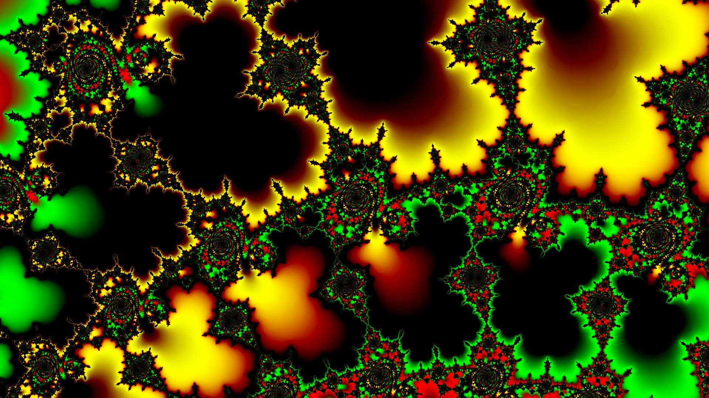
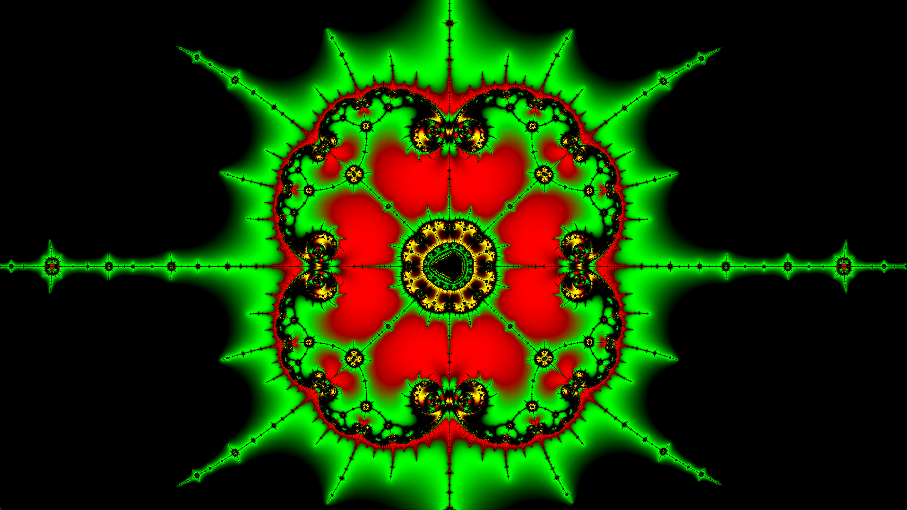
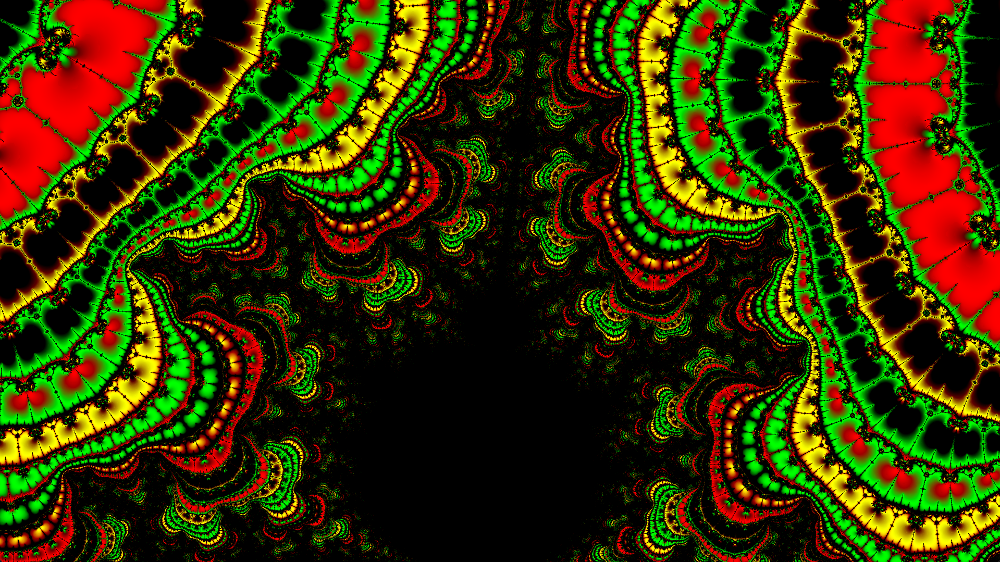

# 🌌 Mandelbrot Set Renderer

<table width="100%">
    <tr>
        <td width="20%"></td>
        <td width="20%"></td>
        <td width="20%"></td>
        <td width="20%"></td>
        <td width="20%"></td>
    </tr>
</table>


https://en.wikipedia.org/wiki/Mandelbrot_set

Modern and high-performance GPU destroyer.

---

## ⚡ Features ⚡

*   🚀 **Blazingly Fast** - Uses all powers of your computer to create useless pictures.
*   🌋 **Modern GPGPU Technologies** - All you gain from this is ~2k loc of render's initialization.
*   ♾️ **Infinite Zoom** - Limited only by your powers and RAM.
*   🏹 **Precision** - You will not see any float lags. (I know secret place where one is, but I won't tell it you)
*   🎨 **Great Palette** - It was selected once, and don't changed since that. This prove it's genius.
*   🖼️ **Minimalistic GUI** - All GUI you get is one clean window, with arrows as manipulators, inspired by most modern designs.
*   🎥 **Video Export** - Save resulting useless records on your disk, so they will consume space in addition to usages of GPU powers.
*   🐧&🪟 **Cross Platform** - This render will happily consume power from both the tux and the M$.
*   ~~🦀~~ **No Rust** - This program __is not__ written in [Rust](https://rust-lang.org/)


## 🎞 Preview

You can download some videos from the [Releases](https://github.com/sprogma/mandelbrot/releases) page.


## 🛫 Prerequisites

For 🪟 you will probably need:

1. [VulkanSDK](https://vulkan.lunarg.com/sdk/home)
2. [SDL3](https://github.com/libsdl-org/SDL/releases)
3. [ffmpeg](https://ffmpeg.org/download.html)
4. [clang 20+](https://releases.llvm.org/download.html)

(Or you can use your favorite package manager)

> [!NOTE]
> To build shaders, you need dxc, which may be installed with vulkanSDK, but may be it wont.
> anyway, if shaders build will be failed, it will fall through on precompiled ones, so
> all will be working.

----

For 🐧 you will ~~die~~ / ~~go see source code~~ / or install this:

Project depends on **Vulkan SDK**, **SDL3**, **ffmpeg** and **clang 20+**.

I believe you can install clang yourself. Guides for other libs: (This commands may not work on all systems)

#### Arch Linux
```bash
sudo pacman -S vulkan-devel sdl3 ffmpeg
```

#### Ubuntu (24.04+)
```bash
sudo apt update && sudo apt install \
  libvulkan-dev vulkan-validationlayers-dev \
  libsdl3-dev \
  libavcodec-dev libavformat-dev libswscale-dev libavutil-dev ffmpeg
```

> [!NOTE]
> On ubuntu <= 24.04 you need install newer clang, at least of version 20.


> [!NOTE]
> On ubuntu <= 22.04 you need build SDL3 yourself.


#### Fedora (40+)
```bash
sudo dnf install \
  vulkan-loader-devel vulkan-validation-layers-devel \
  sdl3-devel \
  ffmpeg-free-devel
```

## ⚙️ Installation

After acquiring all libraries, you need to build code.

For 🪟:
```powershell

# Clone the repository
git clone https://github.com/sprogma/mandelbrot.git
cd mandelbrot

# build
.\build.ps1
```

For 🐧:
```powershell

# Clone the repository
git clone https://github.com/sprogma/mandelbrot.git
cd mandelbrot

# build
make
```


> [!NOTE]
> At build there can be errors in shader compilation. It is ok, program simply will use precompiled shaders.
> This problem is because of buggy dxc compiler of hlsl.


## 🏃‍♂️‍➡️ Very Quick Start

Now, when you installed program, here are set of quick commands to get some results.

```powershell

# 1.  Simply open Mandelbrot set window. (see Controls section to see how you can walk)
./frac.exe -st 0

# 1*. as 1, but select device to run on manually (list can be viewed at start of frac.exe, or in vulkaninfo) (devices are starting from 0 to ...)
./frac.exe -st 0 -d 1

# 2.  Search for interesting point for 30 seconds, and open interactive window. (The more deeper is point, the more interesting it is)
./frac.exe -st 30

# 3.  Search for interesting point for 30 seconds near coordinates X Y
./frac.exe -st 30 -c -1.543689 1e-100

# 4.  Create simple video, named a.mkv long for 5 seconds (and search for interesting point for 30s)
./frac.exe -t 5 -st 30 -o a.mkv

# 5.  ... and with framerate 24 frames per second (default is 30)
./frac.exe -t 5 -st 30 -o a.mkv -f 24

# 6.  ... and with zoom speed 2^3 per second
./frac.exe -t 5 -st 30 -o a.mkv -f 24 -z 3

# 7.  ... and with compression preset 3 (from 0 = most fast & precise, to 5 = most compressed)
./frac.exe -t 5 -st 30 -o a.mkv -f 24 -z 3 -p 3

# 8.  ... and with resolution 1600 x 900 (default is fullHD)
./frac.exe -t 5 -st 30 -o a.mkv -f 24 -z 3 -p 3 -r 1600 900

# 9.  ... and enable float-float emulation of double precision on small zooms (may raise speed on zoom <= 2^40)
./frac.exe -t 5 -st 30 -o a.mkv -f 24 -z 3 -p 3 -r 1600 900 -ff

```

> [!NOTE]
> If you want to cancel rendering before it was finished, you must use sentinel file, as described in Controls section.


> [!NOTE]
> If you want to see rendered results while rendering is still proceeding simply use ffplay a.mkv, it must support playing of not fully written files.


> [!NOTE]
> Video file which was created will probably fail to run in common players (it works in VLC and ffplay).
> it is because of usage BGR0 format in it. To convert video to common formats, use this ffmpeg script
> ```
> ffmpeg -i "input.mkv" -c:v libx264 -crf 17 -pix_fmt yuv420p -x264opts aq-mode=3:aq-strength=1.5:fast_pskip=0:psy=0:deblock=-3,-3 -c:a copy "output.mp4"
> ```
> It will convert format to mp4, more widely known.
>
> To save better quality of edges, you can try to use yuv444p instead of yuv420p, but it is less popular.


## 🎮 Controls


| Key / Input | Action |
| :--- | :--- |
| `Arrows` | Move camera center |
| `Mouse Scroll` | Zoom In / Zoom Out |

> [!NOTE]
> To stop program, press X shape button (or red button) on window.

### How to stop program

If you started render for 1000 seconds, and realized that you want to stop it, follow this steps:

1. Create file named `stop_now` in current directory.

Program will see it, remove it (so you can safely run next render, without need of manually cleaning), and exit, saving current progress.

Copy paste commands:

🪟
```powershell
"">stop_now
```

🐧
```powershell
touch stop_now
```


## 🏗️ Architecture

It is thery simple. Simply calculate one point's path on CPU, and pass it's path buffer on GPU.
There, in shader, calculate displacements from template path, which will be used to find pixels paths.
After that, download resulting buffer, and sending it to ffmpeg api. And all this are done asynchronously.

Calculations on CPU includes floating point calculations with very big presicion. It is done using my single header library lli.h

There was implemented Fast Fourier Transform, using SIMD blocks, to be 🚀 **Blazingly Fast**. Also, additions are also well-optimized.

GPU part uses many textures, staging buffers, other cool things, and is parallel, so it must fully load GPU blocks. The only bottleneck may be compression of frames, which
is little unpredictable because of ffmpeg.


## 📐 The Mathematics

I won't describe here full mathematics staying behind this solutions. So here is only key ideas.


The Mandelbrot set is defined by the iterative sequence:

$$Z_{n+1} = Z_n^2 + C$$

Where:
*   $C$ is a constant point on the complex plane, $C = x + yi$. (= pixel coordinates)
*   $Z_0 = 0$.
*   The pixel remains bounded if $|Z_n| \le 2$ within the maximum iteration threshold.

Then, color of point is selected, based on iteration, on which it was jumped out of set (that is $|Z_n| \gt 2$).

Some points aren't jumping out for very long time, they got stuck in some loops, (becouse it is [functional graph](https://en.wikipedia.org/wiki/Pseudoforest#Graphs_of_functions)), which can be found using [Brent's algorithm](https://en.wikipedia.org/wiki/Cycle_detection#Brent's_algorithm). It is used in low zoom float simulation. On hier zooms, effectivity of algorithm is very poor.

Next question, is how I get from integer loop count smooth color gradient. This process is well described in [this paper](https://linas.org/art-gallery/escape/escape.html)

But common method of calculations have one disadvantage, it requires big precision calculations for each point on screen.
So, i used [perturbation theory](https://en.wikipedia.org/wiki/Perturbation_theory) to solve this problem.
It allows to calculate only one point on screen with full precision, and all other points can use only float's 23 bit mantiss.

But, there is one more problem. Mantiss don't need to be very big, but exponent must. On zooms > 2^30, exponent of simple float ends.
So, i implement FloatExp structure, which contains float mantiss from [1, 2] and integer exponent. This allows infinite zoomings on GPU without precision loss.


One more important find is [Antialiasing](https://en.wikipedia.org/wiki/Anti-aliasing_filter).
In some places, fractal is so tight, that points start generating [white noise](https://en.wikipedia.org/wiki/White_noise) (or may be other color, I dont mind).

Simple solution is to use some well known techics, like TAA, SMAA, or even DLAA 😰.
But i found very intresting method, based on calculating distance to Mandelbrot set using derivative of $Z_n$.
Some of this idieas are described on [page 20 of this book](https://mathr.co.uk/mandelbrot/book-draft-2017-11-10.pdf). 


(In simple words, we try to calculate $d = F/dF$, where $F$ is exponential function ( $F \approx Z_0^{(2^n)}$ ), so, we got $\ln |Z_n| \approx 2^n \cdot ln |Z_0|$, and 
so, $\frac{\ln |Z_n|}{2^n} \approx \ln |Z_0|$.
Next, using [Böttcher's equation](https://en.wikipedia.org/wiki/B%C3%B6ttcher%27s_equation), we can parametrizate Mandelbrot set so, that edge will always
have $\Phi(c) = 1$ (We project set into circle of radius 1). By some chance, using formula from link, we get that $\ln \Phi(c) = \lim \frac{\ln |Z_n|}{2^n}$, and in our case, we know it is almost equal to $Z_0$. How, we can simply use Newton equation, to calculate distance from point to set.
First, use $\ln \Phi(c)$, so it will be equal to $0$ on set edge. Next, use formula (standart Newton formula)

$$ d \approx \frac{\ln |\Phi (c)|}{\left|\frac{\partial }{\partial c}\ln |\Phi (c)|\right|} $$

next we get 

$$ d \approx \frac{\frac{\ln |z_{n}|}{2^n}}{\frac{|z_n ^ {\prime} | }{ 2^n \cdot |z_{n}| }} $$

and finally, $d \approx \frac{ |z_{n}|\cdot \ln |z_{n}| }{ |z_{n}^{\prime }| }$)


Now, we can calculate average distance to border!
Then, we will use fade out to black color the more near point is to set (comparing it to one pixel size). 
That will remove all noises, without any AI, or drawing images of 16 times bigger sizes.

Also, this distance can be sign for early exit. If point is so near edge, that it will be 100% black, we can stop calculating it's path.


One more mathematical problem, is staring point selection.
Perturbation Theory needs center point to be thery deep, so we need to use some good method of finding that point.

This metod is named [Simulated Annealing](https://en.wikipedia.org/wiki/Simulated_annealing).
I could use [Gradient descent](https://en.wikipedia.org/wiki/Gradient_descent), or it's better version, [Mirror descent](https://en.wikipedia.org/wiki/Mirror_descent).
But I was little bit afraid becouse Mandelbrot set have very sharp shapes in some places.
So, universal simulated annealing fits in all requirements from it.

It used some time to tune coefficients, but now they works well (after resently change of BITS values, constants became inaccurate, but still they works).

## ⚙️ Configuration

this is suckless-style 🤓

(the main parameter to be changed is MAX_PATH_LENGTH in `common_defines.h` - it is top border of point's depth. All other parameters are already well-tuned (100%), so change them only if you understand their meanings)


## 🛠 Troubleshooting

* If render is failing, see it's output. It will probably contain reasons, but not always.

* If you see black screen cry about it.

* If application is hanging, wait for it, if this don't helped cry about it.


## 📈 Great-Potential Points

```
points: 

( copypaste_command        #    visual_beauty )

-c -0.743643887037158 0.131825904205311                                        #      65
-c -1.749759145120931 0.000000003906887                                        #      70
-c -0.0864380753683 0.6552945657805                                            #      30
-c -1.250669010848506198642137 0.020120338450174828114402                      #      95
-c -1.9999858817081772 1e-100                                                  #      60
-c -0.77659190638318281232822 0.13664081033010313886566                        #      70
-c -0.749127680229678085786825026861 0.053200536224596671558212847644          #      60
-c -1.543689 1e-100                                                            #      60
-c -1.1769406796 -0.2988763154                                                 #      ??
```


## 📄 License

This project is licensed under the **MIT License**. See the [LICENSE](LICENSE) file for details.
